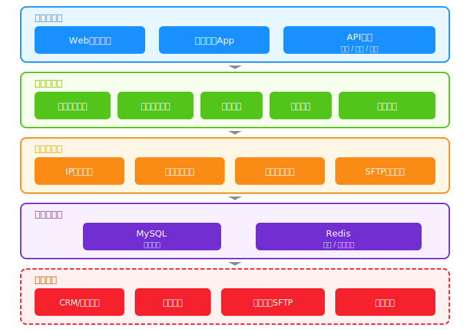
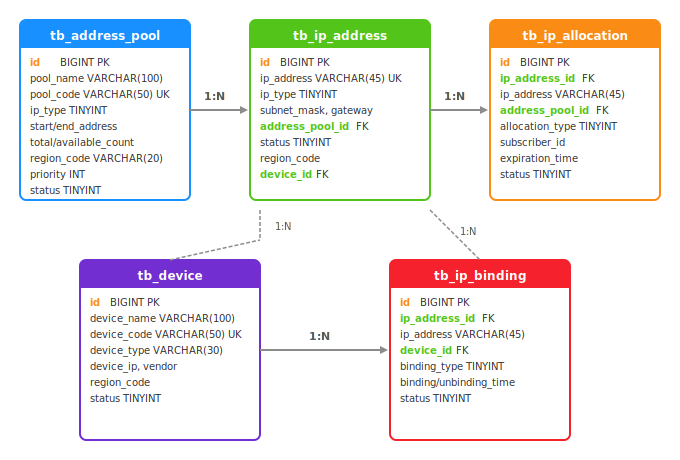
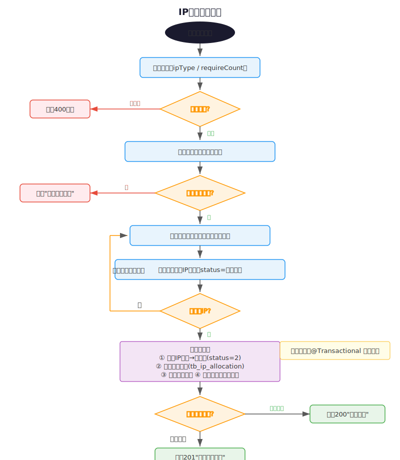
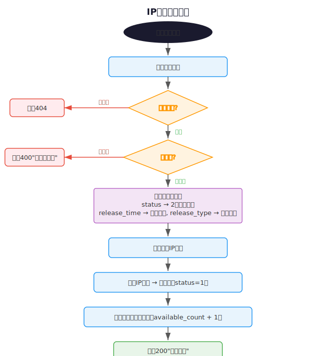
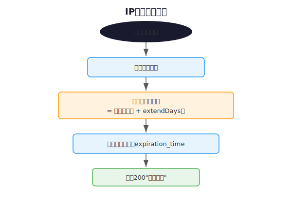
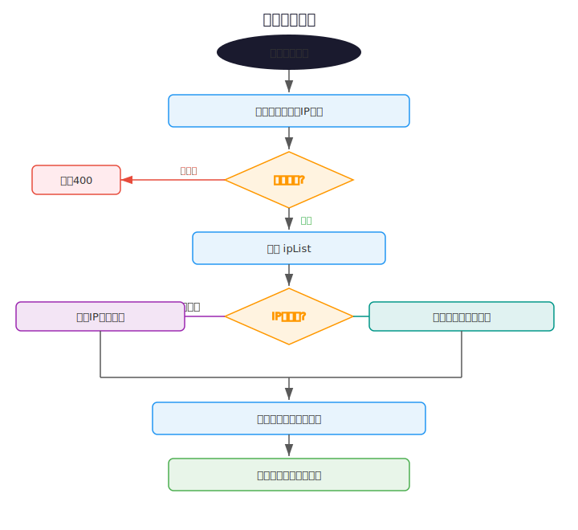
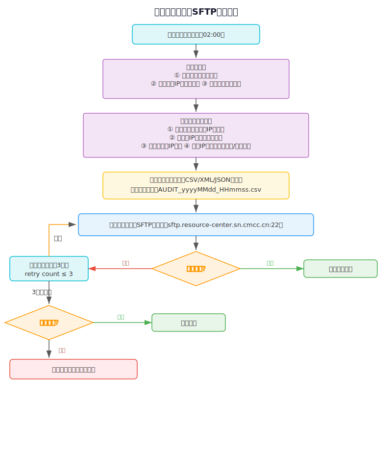
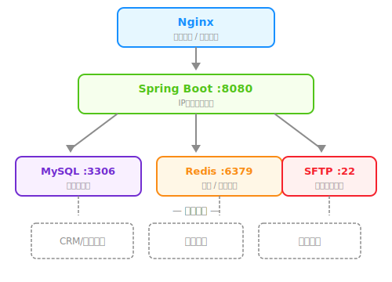

# 中国移动陕西公司IP地址管理系统 — 详细设计文档

## 文档信息

| 项目 | 内容 |
|------|------|
| 系统名称 | IP地址管理系统（IP Management System） |
| 项目标识 | com.cmcc.ip:ip-management-system:1.0.0-SNAPSHOT |
| 版本 | V1.0 |
| 编写日期 | 2026-04-10 |

---

## 1. 系统概述

### 1.1 系统背景

本系统面向中国移动陕西公司，用于管理全省公网/私网IP地址的全生命周期，包括地址池管理、IP地址分配与回收、设备数据采集、IP绑定管理、稽核数据生成与SFTP推送等功能。系统旨在实现IP地址资源的精细化、自动化管理，提升运维效率，保障地址资源合规使用。

### 1.2 系统目标

- 实现IPv4/IPv6地址的统一管理和自动化分配
- 支持多区域（西安、咸阳、渭南等）地址资源的分级管理
- 提供地址全生命周期管理：分配 → 使用 → 续约 → 释放
- 实现设备自动采集与IP地址关联
- 定时稽核数据生成，并自动推送至资源中心SFTP服务器
- 提供多维度的资源查询与统计报表

### 1.3 系统范围

本系统涵盖以下业务领域：

| 领域 | 说明 |
|------|------|
| 地址资源管理 | 地址池CRUD、IP地址CRUD、批量导入导出 |
| 地址分配管理 | 自动/手动分配、释放、续约 |
| 设备管理 | 设备注册、数据采集、状态监控 |
| IP绑定管理 | 静态/动态绑定、解绑 |
| 稽核管理 | 定时稽核、数据比对、SFTP推送 |
| 统计报表 | 使用率统计、趋势分析、区域分布 |

---

## 2. 系统架构设计

### 2.1 总体架构

系统采用分层架构设计，自上而下分为：用户接入层、业务应用层、服务支撑层、数据存储层。



<p style="text-align:center;font-size:11pt;color:#595959;">图2-1 系统总体架构图</p>

### 2.2 技术架构

| 层次 | 技术选型 | 版本 |
|------|---------|------|
| 开发框架 | Spring Boot | 2.7.14 |
| ORM框架 | MyBatis-Plus | 3.5.3 |
| 数据库 | MySQL / H2(开发) | 8.0 / 2.x |
| 缓存 | Redis | - |
| 构建工具 | Maven | 3.x |
| JDK | Java | 1.8 |
| 序列化 | FastJSON | 2.0.32 |
| 工具库 | Lombok, Commons-Lang3 | - |

### 2.3 包结构

```
com.cmcc.ip.system
├── common/                    # 通用类
│   ├── Result.java           # 统一响应封装
│   ├── AllocationRequest.java # 分配请求DTO
│   └── AllocationResult.java  # 分配结果DTO
├── config/                    # 配置类
│   └── MybatisPlusConfig.java # MyBatis-Plus配置(分页/自动填充)
├── controller/                # 控制器层
│   ├── AllocationController.java  # 地址分配API
│   ├── CollectionController.java  # 数据采集API
│   └── ResourceController.java    # 资源查询API
├── entity/                    # 实体层
│   ├── AddressPool.java      # 地址池实体
│   ├── Device.java           # 设备实体
│   ├── IpAddress.java        # IP地址实体
│   ├── IpAllocation.java     # 分配记录实体
│   └── IpBinding.java        # 绑定关系实体
├── mapper/                    # 数据访问层
│   ├── AddressPoolMapper.java/.xml
│   ├── DeviceMapper.java
│   ├── IpAddressMapper.java/.xml
│   ├── IpAllocationMapper.java/.xml
│   └── IpBindingMapper.java
├── service/                   # 业务逻辑层
│   ├── AddressPoolService.java
│   ├── DeviceService.java
│   ├── IpAddressService.java
│   ├── IpAllocationManageService.java
│   └── IpAllocationService.java
└── IpManagementSystemApplication.java  # 启动类
```

---

## 3. 数据库设计

### 3.1 ER关系图



<p style="text-align:center;font-size:11pt;color:#595959;">图3-1 数据库ER关系图</p>

### 3.2 表结构详细设计

#### 3.2.1 地址池表（tb_address_pool）

| 字段名 | 类型 | 是否必填 | 默认值 | 说明 |
|--------|------|---------|--------|------|
| id | BIGINT | PK, AUTO | - | 主键ID |
| pool_name | VARCHAR(100) | NOT NULL | - | 地址池名称 |
| pool_code | VARCHAR(50) | NOT NULL, UK | - | 地址池编码（唯一） |
| ip_type | TINYINT | - | 1 | 地址类型：1-IPv4, 2-IPv6 |
| start_address | VARCHAR(45) | NOT NULL | - | 起始地址 |
| end_address | VARCHAR(45) | NOT NULL | - | 结束地址 |
| total_count | INT | - | 0 | 地址总数 |
| available_count | INT | - | 0 | 可用数量 |
| region_code | VARCHAR(20) | - | NULL | 所属区域编码（XIAN/XY/WN等） |
| allocation_strategy | TINYINT | - | 1 | 分配策略：1-顺序分配, 2-随机分配 |
| priority | INT | - | 0 | 优先级（数值越小越优先） |
| status | TINYINT | - | 1 | 状态：1-启用, 2-禁用 |
| created_time | DATETIME | - | CURRENT_TIMESTAMP | 创建时间 |
| updated_time | DATETIME | - | CURRENT_TIMESTAMP ON UPDATE | 更新时间 |

**索引设计：**

| 索引名 | 类型 | 字段 |
|--------|------|------|
| uk_pool_code | UNIQUE | pool_code |
| idx_ip_type | NORMAL | ip_type |
| idx_region_code | NORMAL | region_code |
| idx_priority | NORMAL | priority |

#### 3.2.2 IP地址表（tb_ip_address）

| 字段名 | 类型 | 是否必填 | 默认值 | 说明 |
|--------|------|---------|--------|------|
| id | BIGINT | PK, AUTO | - | 主键ID |
| ip_address | VARCHAR(45) | NOT NULL, UK | - | IP地址 |
| ip_type | TINYINT | - | 1 | 地址类型：1-IPv4, 2-IPv6 |
| subnet_mask | VARCHAR(45) | - | NULL | 子网掩码 |
| prefix_length | TINYINT | - | NULL | 前缀长度（IPv6） |
| gateway | VARCHAR(45) | - | NULL | 网关地址 |
| dns_primary | VARCHAR(45) | - | NULL | 主DNS |
| dns_secondary | VARCHAR(45) | - | NULL | 辅DNS |
| address_pool_id | BIGINT | - | NULL | 所属地址池ID（FK→tb_address_pool） |
| status | TINYINT | - | 1 | 状态：1-未分配, 2-已分配, 3-预留, 4-冻结 |
| region_code | VARCHAR(20) | - | NULL | 所属区域编码 |
| device_id | BIGINT | - | NULL | 关联设备ID（FK→tb_device） |
| created_time | DATETIME | - | CURRENT_TIMESTAMP | 创建时间 |
| updated_time | DATETIME | - | CURRENT_TIMESTAMP ON UPDATE | 更新时间 |

**索引设计：**

| 索引名 | 类型 | 字段 |
|--------|------|------|
| uk_ip_address | UNIQUE | ip_address |
| idx_address_pool_id | NORMAL | address_pool_id |
| idx_status | NORMAL | status |
| idx_region_code | NORMAL | region_code |

#### 3.2.3 IP分配记录表（tb_ip_allocation）

| 字段名 | 类型 | 是否必填 | 默认值 | 说明 |
|--------|------|---------|--------|------|
| id | BIGINT | PK, AUTO | - | 主键ID |
| ip_address_id | BIGINT | NOT NULL | - | IP地址ID（FK→tb_ip_address） |
| ip_address | VARCHAR(45) | NOT NULL | - | IP地址（冗余） |
| address_pool_id | BIGINT | - | NULL | 地址池ID（FK→tb_address_pool） |
| allocation_type | TINYINT | - | 1 | 分配类型：1-自动分配, 2-手动分配 |
| subscriber_id | VARCHAR(50) | - | NULL | 客户ID |
| service_order_id | VARCHAR(50) | - | NULL | 业务工单ID |
| allocation_time | DATETIME | - | NULL | 分配时间 |
| expiration_time | DATETIME | - | NULL | 到期时间 |
| release_time | DATETIME | - | NULL | 释放时间 |
| release_type | TINYINT | - | NULL | 释放类型：1-到期释放, 2-主动释放 |
| status | TINYINT | - | 1 | 状态：1-使用中, 2-已释放 |
| operator_id | VARCHAR(30) | - | NULL | 操作员ID |
| created_time | DATETIME | - | CURRENT_TIMESTAMP | 创建时间 |

**索引设计：**

| 索引名 | 类型 | 字段 |
|--------|------|------|
| idx_ip_address_id | NORMAL | ip_address_id |
| idx_subscriber_id | NORMAL | subscriber_id |
| idx_service_order_id | NORMAL | service_order_id |
| idx_allocation_time | NORMAL | allocation_time |
| idx_status | NORMAL | status |

#### 3.2.4 设备表（tb_device）

| 字段名 | 类型 | 是否必填 | 默认值 | 说明 |
|--------|------|---------|--------|------|
| id | BIGINT | PK, AUTO | - | 主键ID |
| device_name | VARCHAR(100) | NOT NULL | - | 设备名称 |
| device_code | VARCHAR(50) | NOT NULL, UK | - | 设备编码（唯一） |
| device_type | VARCHAR(30) | - | NULL | 设备类型：OLT/BRAS/交换机等 |
| device_ip | VARCHAR(45) | - | NULL | 设备管理IP地址 |
| vendor | VARCHAR(50) | - | NULL | 设备厂商 |
| region_code | VARCHAR(20) | - | NULL | 所属区域编码 |
| status | TINYINT | - | 2 | 状态：1-在线, 2-离线 |
| last_collection_time | DATETIME | - | NULL | 最后采集时间 |
| created_time | DATETIME | - | CURRENT_TIMESTAMP | 创建时间 |
| updated_time | DATETIME | - | CURRENT_TIMESTAMP ON UPDATE | 更新时间 |

**索引设计：**

| 索引名 | 类型 | 字段 |
|--------|------|------|
| uk_device_code | UNIQUE | device_code |
| idx_device_type | NORMAL | device_type |
| idx_region_code | NORMAL | region_code |

#### 3.2.5 地址绑定关系表（tb_ip_binding）

| 字段名 | 类型 | 是否必填 | 默认值 | 说明 |
|--------|------|---------|--------|------|
| id | BIGINT | PK, AUTO | - | 主键ID |
| ip_address_id | BIGINT | NOT NULL | - | IP地址ID（FK→tb_ip_address） |
| ip_address | VARCHAR(45) | NOT NULL | - | IP地址（冗余） |
| device_id | BIGINT | NOT NULL | - | 设备ID（FK→tb_device） |
| binding_type | TINYINT | - | 1 | 绑定类型：1-静态绑定, 2-动态绑定 |
| binding_time | DATETIME | - | NULL | 绑定时间 |
| unbinding_time | DATETIME | - | NULL | 解绑时间 |
| status | TINYINT | - | 1 | 状态：1-已绑定, 2-已解绑 |
| created_time | DATETIME | - | CURRENT_TIMESTAMP | 创建时间 |

**索引设计：**

| 索引名 | 类型 | 字段 |
|--------|------|------|
| idx_ip_address_id | NORMAL | ip_address_id |
| idx_device_id | NORMAL | device_id |
| idx_status | NORMAL | status |

### 3.3 区域编码定义

| 编码 | 名称 | 说明 |
|------|------|------|
| XIAN | 西安市 | 省会城市，主要业务区域 |
| XY | 咸阳市 | 地级市 |
| WN | 渭南市 | 地级市 |
| BJ | 宝鸡市 | 地级市 |
| TC | 铜川市 | 地级市 |
| HZ | 汉中市 | 地级市 |
| AK | 安康市 | 地级市 |

---

## 4. 接口设计

### 4.1 统一响应格式

```json
{
    "code": 200,
    "message": "成功",
    "data": {}
}
```

| code | 说明 |
|------|------|
| 200 | 成功 |
| 201 | 部分成功 |
| 400 | 参数错误 |
| 404 | 资源不存在 |
| 500 | 系统错误 |

### 4.2 API接口清单

#### 4.2.1 地址分配管理（AllocationController）

**基础路径：** `/api/v1/allocation`

##### (1) IP地址分配

- **URL：** `POST /api/v1/allocation/allocate`
- **请求参数（Body - JSON）：**

| 字段 | 类型 | 必填 | 说明 |
|------|------|------|------|
| ipType | Integer | 是 | 地址类型：1-IPv4, 2-IPv6 |
| regionCode | String | 否 | 区域编码 |
| subscriberId | String | 否 | 客户ID |
| serviceOrderId | String | 否 | 业务工单号 |
| allocationType | Integer | 否 | 分配类型：1-自动, 2-手动（默认1） |
| requireCount | Integer | 是 | 需求数量（>0） |
| expireDays | Integer | 否 | 有效天数 |
| operatorId | String | 否 | 操作员ID |

- **响应参数：**

| 字段 | 类型 | 说明 |
|------|------|------|
| code | Integer | 200-全部成功, 201-部分成功, 400-无可用地址池 |
| message | String | 结果描述 |
| allocationList | Array | 分配结果列表 |
| allocationList[].ipAddress | String | 分配的IP地址 |
| allocationList[].addressPoolId | Long | 所属地址池ID |
| allocationList[].allocationId | Long | 分配记录ID |

##### (2) IP地址释放

- **URL：** `POST /api/v1/allocation/release`
- **请求参数（Query）：**

| 字段 | 类型 | 必填 | 说明 |
|------|------|------|------|
| allocationId | Long | 是 | 分配记录ID |
| releaseType | Integer | 否 | 释放类型：1-到期释放, 2-主动释放（默认2） |

- **响应参数：**

| 字段 | 类型 | 说明 |
|------|------|------|
| code | Integer | 200-成功, 400-已释放, 404-不存在 |
| message | String | 结果描述 |

##### (3) IP地址续约

- **URL：** `POST /api/v1/allocation/renew`
- **请求参数（Query）：**

| 字段 | 类型 | 必填 | 说明 |
|------|------|------|------|
| allocationId | Long | 是 | 分配记录ID |
| extendDays | Integer | 是 | 续约天数（>0） |

- **响应参数：**

| 字段 | 类型 | 说明 |
|------|------|------|
| code | Integer | 200-成功, 500-失败 |
| message | String | 结果描述 |

#### 4.2.2 资源查询（ResourceController）

**基础路径：** `/api/v1/resource`

##### (1) IP地址查询

- **URL：** `GET /api/v1/resource/ip-address`
- **请求参数（Query）：**

| 字段 | 类型 | 必填 | 默认值 | 说明 |
|------|------|------|--------|------|
| ipAddress | String | 否 | - | IP地址（精确匹配） |
| ipType | Integer | 否 | - | 地址类型 |
| addressPoolId | Long | 否 | - | 地址池ID |
| status | Integer | 否 | - | 状态 |
| regionCode | String | 否 | - | 区域编码 |
| pageNum | Integer | 否 | 1 | 页码 |
| pageSize | Integer | 否 | 20 | 每页条数 |

- **响应参数：**

| 字段 | 类型 | 说明 |
|------|------|------|
| list | Array | IP地址列表 |
| total | Long | 总记录数 |
| pageNum | Long | 当前页码 |
| pageSize | Long | 每页条数 |

##### (2) IP地址批量查询

- **URL：** `POST /api/v1/resource/ip-address/batch`
- **请求参数（Body - JSON）：** `["218.201.1.10", "10.0.1.50"]`

- **响应参数：**

| 字段 | 类型 | 说明 |
|------|------|------|
| list | Array | IP地址详情列表 |

##### (3) 地址池查询

- **URL：** `GET /api/v1/resource/address-pool`
- **请求参数（Query）：**

| 字段 | 类型 | 必填 | 默认值 | 说明 |
|------|------|------|--------|------|
| poolCode | String | 否 | - | 地址池编码 |
| ipType | Integer | 否 | - | 地址类型 |
| regionCode | String | 否 | - | 区域编码 |
| status | Integer | 否 | - | 状态 |
| pageNum | Integer | 否 | 1 | 页码 |
| pageSize | Integer | 否 | 20 | 每页条数 |

#### 4.2.3 数据采集（CollectionController）

**基础路径：** `/api/v1/collection`

##### (1) 接收采集数据

- **URL：** `POST /api/v1/collection/receive`
- **请求参数（Body - JSON）：**

```json
{
    "deviceCode": "OLT-XA-001",
    "ipList": [
        {
            "ipAddress": "218.201.1.10",
            "ipType": 1,
            "subnetMask": "255.255.255.0",
            "gateway": "218.201.1.1",
            "regionCode": "XIAN",
            "status": 2
        }
    ]
}
```

- **响应参数：**

| 字段 | 类型 | 说明 |
|------|------|------|
| receivedCount | Integer | 成功接收数量 |
| failList | Array | 失败列表 |
| failList[].ipAddress | String | 失败的IP地址 |
| failList[].reason | String | 失败原因 |

##### (2) 设备注册

- **URL：** `POST /api/v1/collection/device/register`
- **请求参数（Body - JSON）：**

```json
{
    "deviceName": "西安OLT-001",
    "deviceCode": "OLT-XA-001",
    "deviceType": "OLT",
    "deviceIp": "10.255.0.1",
    "vendor": "华为",
    "regionCode": "XIAN"
}
```

##### (3) 查询采集状态

- **URL：** `GET /api/v1/collection/status/{deviceCode}`
- **响应参数：**

| 字段 | 类型 | 说明 |
|------|------|------|
| deviceCode | String | 设备编码 |
| lastCollectionTime | Date | 最后采集时间 |
| collectionStatus | Integer | 设备状态 |

---

## 5. 业务流程设计

### 5.1 IP地址分配流程



<p style="text-align:center;font-size:11pt;color:#595959;">图5-1 IP地址分配流程图</p>

> 事务控制：整个分配过程在同一事务中执行（@Transactional），任何步骤失败则全部回滚。

### 5.2 IP地址释放流程



<p style="text-align:center;font-size:11pt;color:#595959;">图5-2 IP地址释放流程图</p>

### 5.3 IP地址续约流程



<p style="text-align:center;font-size:11pt;color:#595959;">图5-3 IP地址续约流程图</p>

### 5.4 数据采集流程



<p style="text-align:center;font-size:11pt;color:#595959;">图5-4 数据采集流程图</p>

### 5.5 稽核数据生成与SFTP推送流程



<p style="text-align:center;font-size:11pt;color:#595959;">图5-5 稽核数据生成与SFTP推送流程图</p>

---

## 6. 核心类设计

### 6.1 实体类（Entity）

#### IpAddress

```java
@TableName("tb_ip_address")
public class IpAddress {
    private Long id;              // 主键
    private String ipAddress;     // IP地址
    private Integer ipType;       // 类型：1-IPv4, 2-IPv6
    private String subnetMask;    // 子网掩码
    private Integer prefixLength; // 前缀长度
    private String gateway;       // 网关
    private String dnsPrimary;    // 主DNS
    private String dnsSecondary;  // 辅DNS
    private Long addressPoolId;   // 地址池ID
    private Integer status;       // 状态：1-未分配, 2-已分配, 3-预留, 4-冻结
    private String regionCode;    // 区域编码
    private Long deviceId;        // 设备ID
    private Date createdTime;     // 创建时间（自动填充）
    private Date updatedTime;     // 更新时间（自动填充）

    enum IpType { IPv4(1), IPv6(2) }
    enum Status { UNASSIGNED(1), ASSIGNED(2), RESERVED(3), FROZEN(4) }
}
```

#### AddressPool

```java
@TableName("tb_address_pool")
public class AddressPool {
    private Long id;
    private String poolName;            // 地址池名称
    private String poolCode;            // 编码（唯一）
    private Integer ipType;             // 1-IPv4, 2-IPv6
    private String startAddress;        // 起始地址
    private String endAddress;          // 结束地址
    private Integer totalCount;         // 总数
    private Integer availableCount;     // 可用数
    private String regionCode;          // 区域编码
    private Integer allocationStrategy; // 1-顺序, 2-随机
    private Integer priority;           // 优先级（数值越小越优先）
    private Integer status;             // 1-启用, 2-禁用

    enum AllocationStrategy { SEQUENTIAL(1), RANDOM(2) }
    enum PoolStatus { ENABLED(1), DISABLED(2) }
}
```

#### IpAllocation

```java
@TableName("tb_ip_allocation")
public class IpAllocation {
    private Long id;
    private Long ipAddressId;       // IP地址ID
    private String ipAddress;       // IP地址（冗余）
    private Long addressPoolId;     // 地址池ID
    private Integer allocationType; // 1-自动, 2-手动
    private String subscriberId;    // 客户ID
    private String serviceOrderId;  // 工单号
    private Date allocationTime;    // 分配时间
    private Date expirationTime;    // 到期时间
    private Date releaseTime;       // 释放时间
    private Integer releaseType;    // 1-到期释放, 2-主动释放
    private Integer status;         // 1-使用中, 2-已释放
    private String operatorId;      // 操作员

    enum AllocationType { AUTO(1), MANUAL(2) }
    enum ReleaseType { EXPIRE(1), MANUAL(2) }
    enum AllocationStatus { IN_USE(1), RELEASED(2) }
}
```

#### Device

```java
@TableName("tb_device")
public class Device {
    private Long id;
    private String deviceName;          // 设备名称
    private String deviceCode;          // 编码（唯一）
    private String deviceType;          // OLT/BRAS/交换机
    private String deviceIp;            // 管理IP
    private String vendor;              // 厂商
    private String regionCode;          // 区域
    private Integer status;             // 1-在线, 2-离线
    private Date lastCollectionTime;    // 最后采集时间

    enum DeviceStatus { ONLINE(1), OFFLINE(2) }
}
```

#### IpBinding

```java
@TableName("tb_ip_binding")
public class IpBinding {
    private Long id;
    private Long ipAddressId;       // IP地址ID
    private String ipAddress;       // IP地址（冗余）
    private Long deviceId;          // 设备ID
    private Integer bindingType;    // 1-静态, 2-动态
    private Date bindingTime;       // 绑定时间
    private Date unbindingTime;     // 解绑时间
    private Integer status;         // 1-已绑定, 2-已解绑

    enum BindingType { STATIC(1), DYNAMIC(2) }
    enum BindingStatus { BOUND(1), UNBOUND(2) }
}
```

### 6.2 服务类（Service）

#### IpAllocationManageService

核心业务编排类，协调IpAddressService、AddressPoolService、IpAllocationService完成分配、释放、续约操作。

| 方法 | 说明 | 事务 |
|------|------|------|
| allocate(AllocationRequest) | 按优先级遍历地址池，批量分配IP | @Transactional |
| release(Long allocationId, Integer releaseType) | 释放IP，恢复地址池可用数 | @Transactional |
| renew(Long allocationId, Integer extendDays) | 延长分配到期时间 | @Transactional |

#### AddressPoolService

| 方法 | 说明 |
|------|------|
| queryList(query, pageNum, pageSize) | 分页查询地址池 |
| getById(Long id) | 按ID查询 |
| getByPoolCode(String poolCode) | 按编码查询 |
| selectByPriority(ipType, regionCode, status) | 按优先级排序查询 |
| save(AddressPool) | 新增地址池 |
| update(AddressPool) | 更新地址池 |
| updateAvailableCount(Long id, Integer count) | 更新可用数量（原子操作） |

#### IpAddressService

| 方法 | 说明 |
|------|------|
| queryList(query, pageNum, pageSize) | 分页查询IP地址 |
| getById(Long id) | 按ID查询 |
| getByIpAddress(String ipAddress) | 按IP地址查询 |
| selectAvailableList(ipType, regionCode, poolId, limit) | 查询可用IP列表 |
| save(IpAddress) | 新增IP |
| update(IpAddress) | 更新IP |
| updateStatusBatch(List<Long> ids, Integer status) | 批量更新状态 |

#### IpAllocationService

| 方法 | 说明 |
|------|------|
| queryList(query, pageNum, pageSize) | 分页查询分配记录 |
| getById(Long id) | 按ID查询 |
| selectBySubscriberId(String) | 按客户ID查询 |
| selectByServiceOrderId(String) | 按工单号查询 |
| selectActiveBySubscriberId(String) | 查询客户的有效分配 |
| save(IpAllocation) | 新增分配记录 |
| release(Long allocationId, Integer releaseType) | 释放 |
| renew(Long allocationId, Integer extendDays) | 续约 |

#### DeviceService

| 方法 | 说明 |
|------|------|
| queryList(Device query) | 条件查询设备 |
| getById(Long id) | 按ID查询 |
| getByDeviceCode(String deviceCode) | 按编码查询 |
| save(Device) | 新增设备 |
| update(Device) | 更新设备 |
| updateCollectionTime(String deviceCode) | 更新采集时间 |

### 6.3 自定义SQL（Mapper XML）

#### AddressPoolMapper.xml

```sql
-- 按优先级查询可用地址池
SELECT * FROM tb_address_pool
WHERE 1=1
  AND ip_type = #{ipType}           -- 可选
  AND region_code = #{regionCode}   -- 可选
  AND status = #{status}            -- 可选
ORDER BY priority ASC

-- 原子更新可用数量
UPDATE tb_address_pool
SET available_count = available_count + #{count}
WHERE id = #{id}
```

#### IpAddressMapper.xml

```sql
-- 查询可用IP列表
SELECT * FROM tb_ip_address
WHERE status = 1                    -- 未分配
  AND ip_type = #{ipType}           -- 可选
  AND region_code = #{regionCode}   -- 可选
  AND address_pool_id = #{addressPoolId} -- 可选
LIMIT #{limitCount}

-- 按地址池查询
SELECT * FROM tb_ip_address
WHERE address_pool_id = #{addressPoolId}

-- 批量更新状态
UPDATE tb_ip_address
SET status = #{status}, updated_time = NOW()
WHERE id IN (#{ids})
```

#### IpAllocationMapper.xml

```sql
-- 按客户ID查询
SELECT * FROM tb_ip_allocation WHERE subscriber_id = #{subscriberId}

-- 按工单号查询
SELECT * FROM tb_ip_allocation WHERE service_order_id = #{serviceOrderId}

-- 查询客户有效分配
SELECT * FROM tb_ip_allocation
WHERE subscriber_id = #{subscriberId} AND status = 1
```

---

## 7. 非功能性设计

### 7.1 事务管理

| 操作 | 事务范围 | 说明 |
|------|---------|------|
| IP分配 | @Transactional | 分配IP+创建记录+更新池计数，原子操作 |
| IP释放 | @Transactional | 释放记录+恢复IP状态+恢复池计数，原子操作 |
| IP续约 | @Transactional | 更新到期时间 |
| 采集数据接收 | @Transactional | 批量更新/插入IP+更新采集时间 |

### 7.2 并发控制

- **地址池可用数量更新：** 使用SQL原子操作 `available_count = available_count + #{count}`，避免超分配
- **IP分配：** 建议在获取可用IP时加分布式锁（Redis），防止同一IP被并发分配
- **到期释放：** 定时任务扫描到期未释放记录，建议使用数据库行级锁

### 7.3 性能设计

| 场景 | 策略 |
|------|------|
| IP地址查询 | 分页查询 + 组合索引 |
| 可用IP检索 | status索引 + LIMIT限制 |
| 地址池优先级排序 | priority索引 |
| 大批量采集数据 | 分批提交，单条失败不影响整体 |
| 统计报表 | 建议定时物化统计数据，避免实时聚合 |

### 7.4 安全设计

- API网关统一认证鉴权
- 操作员ID记录（operator_id字段）
- 审计日志记录关键操作
- SFTP密钥认证

### 7.5 可靠性设计

- SFTP推送失败自动重试（最多3次）
- 稽核任务失败告警
- 数据库事务保障数据一致性
- MyBatis-Plus自动填充时间字段

---

## 8. 配置说明

### 8.1 应用配置（application.yml）

```yaml
server:
  port: 8080                          # 服务端口

spring:
  datasource:
    driver-class-name: org.h2.Driver  # 开发环境使用H2内存数据库
    url: jdbc:h2:mem:ip_management    # 生产环境切换为MySQL
  h2:
    console:
      enabled: true                   # H2控制台（仅开发环境）
  sql:
    init:
      mode: always                    # 启动时执行初始化SQL

mybatis-plus:
  mapper-locations: classpath*:/mapper/**/*.xml
  type-aliases-package: com.cmcc.ip.system.entity
  configuration:
    map-underscore-to-camel-case: true     # 下划线转驼峰
    log-impl: org.apache.ibatis.logging.stdout.StdOutImpl  # SQL日志
  global-config:
    db-config:
      id-type: auto                    # 主键自增
```

### 8.2 生产环境配置建议

```yaml
spring:
  datasource:
    driver-class-name: com.mysql.cj.jdbc.Driver
    url: jdbc:mysql://localhost:3306/ip_management?useUnicode=true&characterEncoding=utf8&serverTimezone=Asia/Shanghai
    username: ${DB_USERNAME}
    password: ${DB_PASSWORD}
  redis:
    host: ${REDIS_HOST}
    port: 6379
    password: ${REDIS_PASSWORD}
```

---

## 9. 部署架构



<p style="text-align:center;font-size:11pt;color:#595959;">图9-1 部署架构图</p>

---

## 10. 术语表

| 术语 | 说明 |
|------|------|
| 地址池（Address Pool） | 一组连续IP地址的集合，用于IP分配 |
| OLT | 光线路终端（Optical Line Terminal） |
| BRAS | 宽带远程接入服务器（Broadband Remote Access Server） |
| 稽核（Audit） | 对IP地址使用情况进行校验和比对 |
| SFTP | 安全文件传输协议（SSH File Transfer Protocol） |
| region_code | 区域编码，标识IP/设备所属行政区域 |
| 分配策略 | 地址池的IP分配方式：顺序或随机 |
| 优先级 | 地址池的分配优先顺序，数值越小越优先分配 |
